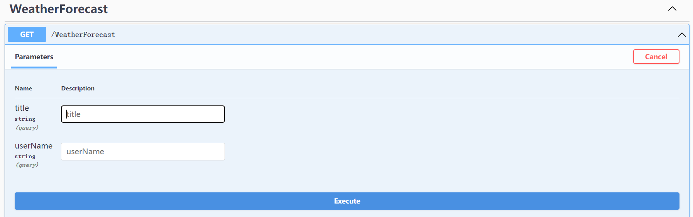

## IGeekFan.FreeKit.Extras
该项目是基于FreeSql实现的一些扩展包、AOP事务，当前用户，简化依赖注入
- 依赖项
```xml
<PackageReference Include="FreeSql.DbContext" Version="3.0.100" />
<PackageReference Include="Autofac.Extensions.DependencyInjection" Version="7.2.0" />
<PackageReference Include="Autofac.Extras.DynamicProxy" Version="6.0.0" />
<PackageReference Include="Castle.Core.AsyncInterceptor" Version="2.0.0" />

```
根据自己访问数据库的不同，安装对应的[Provider](http://freesql.net/guide/install.html#packages)
```
dotnet add package FreeSql.Provider.Sqlite
dotnet add package IGeekFan.FreeKit.Extras
```

### FreeSql扩展包
- 基于特性标签的AOP事务
- 基于接口的注入
- 通用CRUD的
- 当前用户
- 简化单库的配置
- FluentAPI基于接口的配置实体


#### UseConnectionString扩展方法 简化单库的配置
```csharp
    public static IServiceCollection AddFreeSql(this IServiceCollection services, IConfiguration configuration)
    {
        IFreeSql fsql = new FreeSqlBuilder()
                  .UseConnectionString(configuration)
                  .UseNameConvert(NameConvertType.PascalCaseToUnderscoreWithLower)
                  .UseAutoSyncStructure(true) //自动同步实体结构到数据库，FreeSql不会扫描程序集，只有CRUD时才会生成表。
                  .UseMonitorCommand(cmd =>
                  {
                      Trace.WriteLine(cmd.CommandText + ";");
                  })
                  .Build();

        fsql.GlobalFilter.Apply<ISoftDelete>("IsDeleted", a => a.IsDeleted == false);

        services.AddSingleton<IFreeSql>(fsql);
        services.AddFreeRepository();
        services.AddScoped<UnitOfWorkManager>();

        return services;
    }
```
- appsettings.json
```json
"ConnectionStrings": {
    "DefaultDB": "0",
    "DataType": {
        "MySql": 0,
        "SqlServer": 1,
        "PostgreSQL": 2,
        "Oracle": 3,
        "Sqlite": 4
     },
    "MySql": "Data Source=localhost;Port=3306;User ID=root;Password=root;Initial Catalog=freekit;Charset=utf8mb4;SslMode=none;Max pool size=1;Connection LifeTime=20",
    "SqlServer": "Data Source=.;User ID=sa;Password=123456;Integrated Security=True;Initial Catalog=LinCMS;Pooling=true;Min Pool Size=1",
    "PostgreSQL": "Host=localhost;Port=5432;Username=postgres;Password=123456; Database=lincms;Pooling=true;Minimum Pool Size=1",
    "Oracle": "user id=user1;password=123456; data source=//127.0.0.1:1521/ORCL;Pooling=true;Min Pool Size=1",
    "Sqlite": "Data Source=|DataDirectory|\\freekit.db; Attachs=freekit.db; Pooling=true;Min Pool Size=1"
    }
```

#### 基于特性标签的AOP事务

- **[Transactional]**

通过 Autofac配置哪些类需要基于特性标签的AOP事务
```csharp
    /// <summary>
    /// 注入Application层中的Service
    /// </summary>
    public class ServiceModule : Autofac.Module
    {
        protected override void Load(ContainerBuilder builder)
        {
            builder.RegisterType<UnitOfWorkInterceptor>();
            builder.RegisterType<UnitOfWorkAsyncInterceptor>();

            List<Type> interceptorServiceTypes = new List<Type>()
            {
                typeof(UnitOfWorkInterceptor)
            };

            string[] notIncludes = new string[]
            {
            };

            Assembly servicesDllFile = Assembly.Load("LinCms.Application");
            builder.RegisterAssemblyTypes(servicesDllFile)
                .Where(a => a.Name.EndsWith("Service") && !notIncludes.Where(r => r == a.Name).Any() && !a.IsAbstract && !a.IsInterface && a.IsPublic)
                .AsImplementedInterfaces()
                .InstancePerLifetimeScope()
                .PropertiesAutowired()// 属性注入
                .InterceptedBy(interceptorServiceTypes.ToArray())
                .EnableInterfaceInterceptors();

        }
    }
```

如果依旧是Startup的模式，可通过ConfigureContainer配置服务
- Program.cs配置
```
    Host.CreateDefaultBuilder(args)
                .UseServiceProviderFactory(new AutofacServiceProviderFactory())
                .ConfigureWebHostDefaults(webBuilder =>
                {
                    webBuilder.UseStartup<Startup>();
                });
```
- Startup.cs配置
```csharp
    public void ConfigureContainer(ContainerBuilder builder)
    {
        builder.RegisterModule(new ServiceModule());
    }
```
或
```csharp
builder.Host
    .UseServiceProviderFactory(new AutofacServiceProviderFactory())
    .ConfigureContainer<ContainerBuilder>((webBuilder, containerBuilder) =>
    {
        containerBuilder.RegisterModule(new ServiceModule());
    });
```

#### 基于接口的注入
- IScopedDependency 范围
- ISingletonDependency 单例
- ITransientDependency 瞬时

```csharp
namespace Module1
{
    public interface ITestService : ITransientDependency
    {
        bool ExecuteConnectTest();
    }
}

namespace Module1
{
    public class TestService : ITestService
    {
        private readonly IFreeSql _fsql;
        public TestService(IFreeSql fsql)
        {
            _fsql = fsql;
        }

        public bool ExecuteConnectTest()
        {
            return _fsql.Ado.ExecuteConnectTest();
        }
    }
}

public class TestController : Controller
{
    ILogger<TestController> logger;
    private readonly ITestService testService;

    public TestController(ILogger<TestController> logger, ITestService testService)
    {
        this.logger = logger;
        this.testService = testService;
    }

    [HttpGet("ExecuteConnectTest")]
    public ActionResult<bool> ExecuteConnectTest()
    {
        return testService.ExecuteConnectTest();
    }
}

```
```csharp
builder.Host
    .UseServiceProviderFactory(new AutofacServiceProviderFactory())
    .ConfigureContainer<ContainerBuilder>((webBuilder, containerBuilder) =>
    {
        Assembly[] currentAssemblies = AppDomain.CurrentDomain.GetAssemblies().Where(r => r.FullName.Contains("IGeekFan.FreeKit.Extras")|| r.FullName.Contains("Module1")).ToArray();

        containerBuilder.RegisterModule(new FreeKitModule(currentAssemblies));
    });
```

### 实体审计类

- FullAduitEntity
- Entity
- ICreateAduitEntity
- IUpdateAuditEntity
- IDeleteAduitEntity
- ISoftDelete


### CaseQuery转换
`HttpGet`请求时，参数的key和实体相同，比如创建如下类。
```csharp
public class QueryModel
{
    public string Title { get; set; }
    public string UserName { get; set; }
}
```
```csharp
[HttpGet]
public IEnumerable<WeatherForecast> Get([FromQuery] QueryModel queryModel)
{
    return null;
}
```
在swagger下就会生成如下内容


如果实现，GET请求参数的key转换呢。

##### 查询参数转换支持
- SnakeCase（下划线写法）
- LowerCase（小写）
- CamelCase（首字母小写）

#### 使用方式 

在AddControllers中注入实现
```csharp
    services.AddControllers(options =>
    {
        options.ValueProviderFactories.Add(new CamelCaseValueProviderFactory());
    });
```
swagger渲染需要替换provider
```csharp
    services.TryAddEnumerable(ServiceDescriptor.Transient<IApiDescriptionProvider, CamelCaseApiDescriptionProvider>());
```




其中支持的Factory如下
- SnakeCaseValueProviderFactory（下划线写法）
- LowerCaseValueProviderFactory（小写）
- CamelCaseValueProviderFactory（首字母小写）

Provider支持如下
- SnakeApiDescriptionProvider（下划线写法）
- LowerApiDescriptionProvider（小写）
- CamelCaseApiDescriptionProvider（首字母小写）